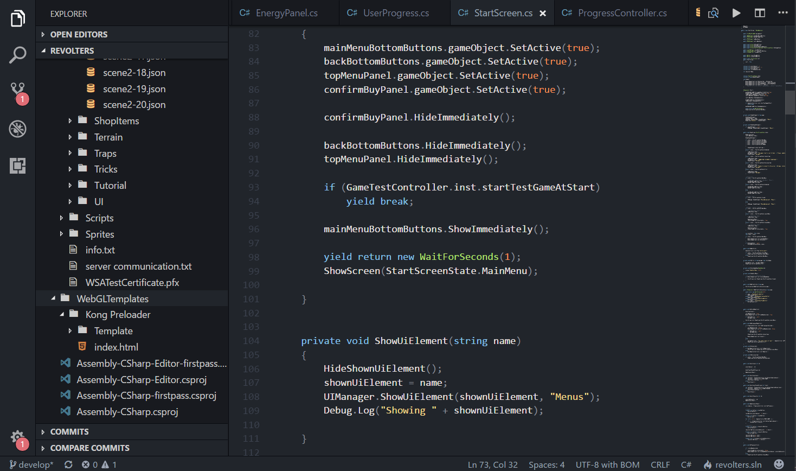
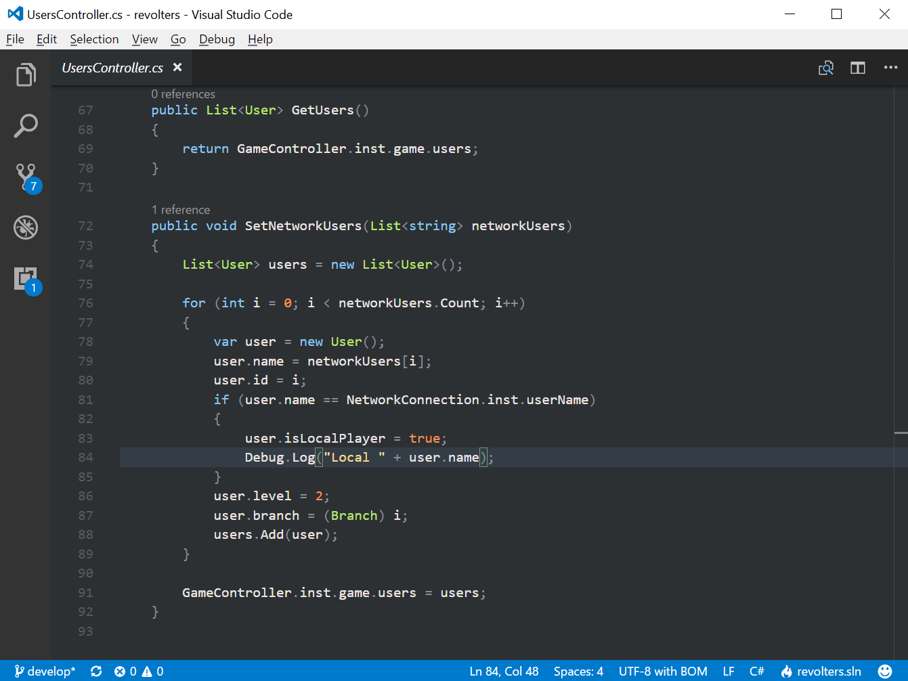
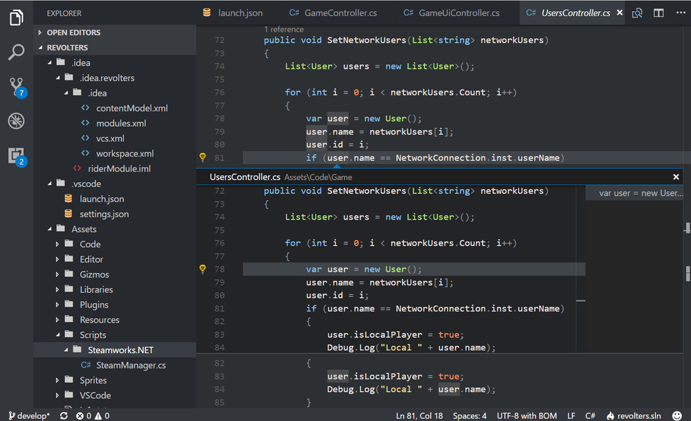
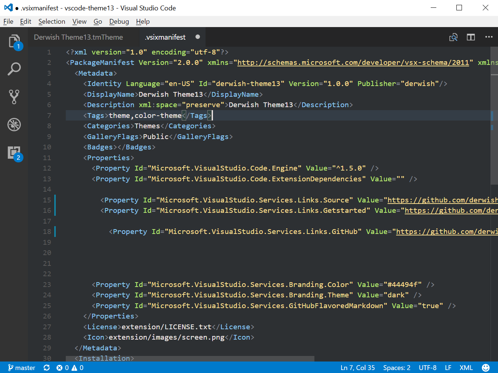
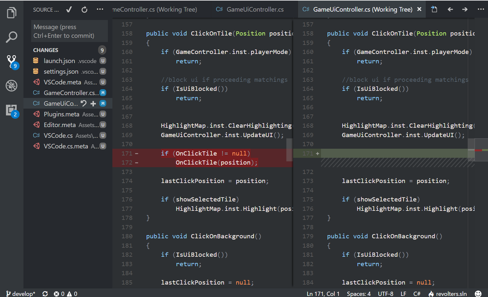

# Derwish Theme13
A dark minimalistic theme for VSCode.

[GitHub repository](https://github.com/dy-sh/vscode-theme13)

## Dark Version

## Default Version

# Tweaks

Use "file-icons" extension for icons.

# Downoad this theme for other apps

[JetBrains IDEs](https://github.com/dy-sh/jetbrains-theme13)  
[Directory Opus](https://resource.dopus.com/t/derwish-theme13)  
[PotPlayer](https://potplayer.daum.net/forum/viewtopic.php?f=11&t=20924)  

